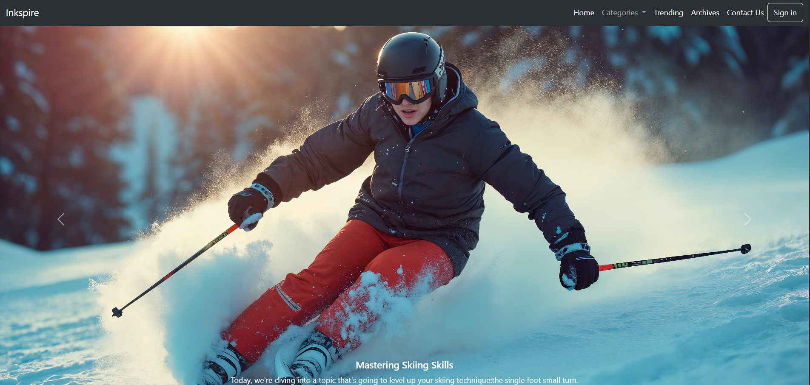

# 📝 Bootstrap Blog Front-End

This is a simple **static blog front-end** created entirely using the **Bootstrap framework**.  
The project was built to practice Bootstrap's layout system, components, and responsive design techniques.

> 🚫 This project does not include any back-end functionality (like posting, commenting, or user login).

---

## 📸 Preview

---

## 🛠️ Technologies Used

- HTML5  
- CSS3  
- Bootstrap 5

---

## 🎯 Features

- Responsive layout using Bootstrap Grid
- Blog-style cards for posts
- Navigation bar with branding
- Footer section
- Clean, modern design using Bootstrap components
